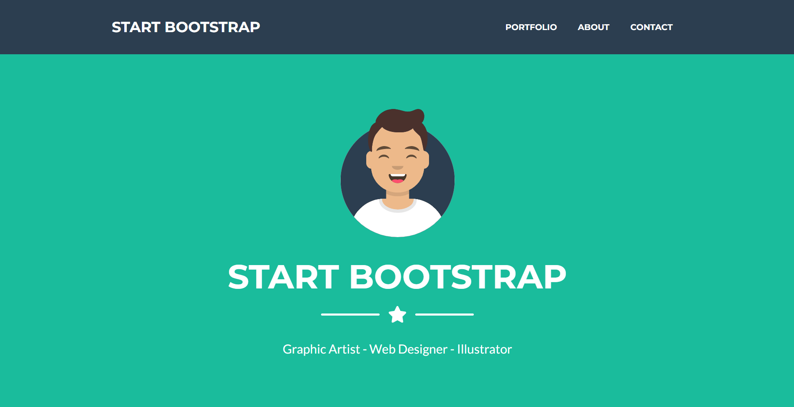
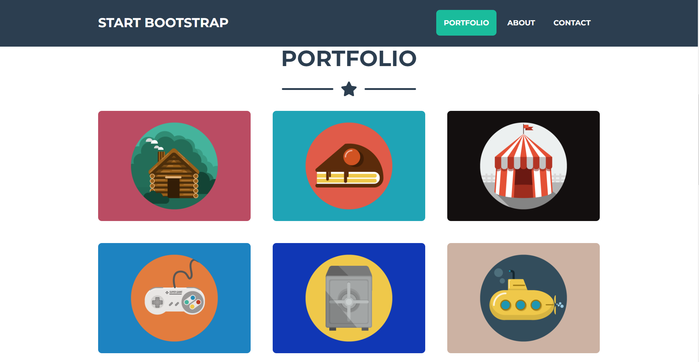

# Converting Existing webpage to React

## **Project: Converting Startbootstrap Theme - Freelancer page to React**

### Concepts learned from this project:
- Learned about creating boiler-plate code of ReactJS.
- Learned to rewrite src folder from scratch
- Learned to divide pages parts into components.
- Learned how props work and destructured props and passed data.

**Existing Page Link :** [Link](https://startbootstrap.com/previews/freelancer)

**Deployed Link :** [Link](https://startbootstrap-theme-to-react.netlify.app/)
>### Preview :

